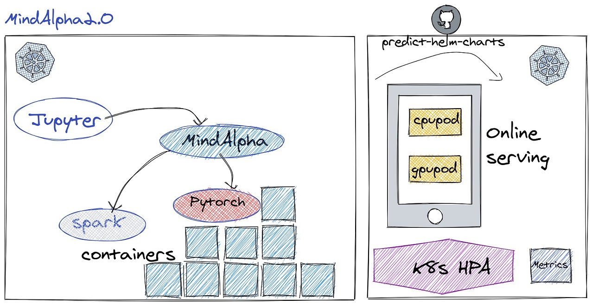

# Predict Helm Charts

## Introduction

Predict is an online prediction service for model exported by pytorch torch script, which is part of MindAlpha.
Our predict supports single model and multi-models inference, with providing the consul keyprefix of the models.
The keyprefix stores models information, such as model name, cloud address of model data, data version, download command, etc.
By default our service could auto scale by cpu or gpu utilization, or by the metrics defined in prometheous-adapter.yaml.
[prometheus_adapter.yaml](prometheus-adapter/prometheus_adapter.yaml) is an metrics example. You need to define your metrics according to the official document [metric rules](https://github.com/kubernetes-sigs/prometheus-adapter/blob/master/docs/config.md)



## Prerequisites

1. A Kubernetes cluster. Kubenetes version 1.18 or above is required.
2. A consul cluster, used to store model information and service discovery.
    In our service, the consul agent will join the cluster.
3. [MindAlpha platform](https://github.com/mindalpha/MindAlpha) , which preprocessing, model training and exporting model data. 
4. You should add labels to your nodes.  The labels you should set are: service_type, nodestype. After then, modify predict/values.yaml and predict/values_cpu.yaml, set the label selector value of the label to what you set to node labels.


## Deploy

[install.sh](install.sh) will not install [Prometheus](https://prometheus.io/) && [Grafana](https://grafana.com/).
You should install [Prometheus](https://prometheus.io/) && [Grafana](https://grafana.com/) first by yourself. You could use the official helm chart to install them.

```bash
#install prometheus command
helm repo add prometheus-community https://prometheus-community.github.io/helm-charts
helm repo update
helm install prometheus-stack prometheus-community/kube-prometheus-stack
```
>Note: when you have installed the [Prometheus](https://prometheus.io/), you can skip this step

### 1. Prepare ENV Vars

Before installing, we should define a set of environment variables in [env.sh](env.sh)
If you are using aliyun cloud, you should specify oss config.

```bash
#specify your own values
export IMAGE_REPO=YOUR-PREFIX/mindalpha-serving-centos
export RELEASE=example
export CPU_RELEASE=examplecpu
export PREDICT_NAMESPACE=mindalpha-serving
export MINDALPHA_ROLE_ARN=arn:aws:iam::YOUR-ACCOUNT-NUMBER:role/YOUR-ROLE-NAME
export AWS=true
export SERVICE_ACCOUNT_CREATE=true
export SERVICEMONITOR_RELEASE=prometheus-stack
export PROMETHEUS_URL=""
#consul
export CONSUL_DC=dc-consul
export CONSUL_CLUSTER=dc-consul.cluster.com
export CONSUL_KEYPREFIX=data/example
export CONSUL_SERVICE=example.nps.svc.cluster

#oss
export OSS_ENDPOINT=""
export OSS_ID=""
export OSS_SECRET=""

#gpu env
export GPU_NODE_LABEL="nps-gpu-nodes"
export GPU=true
export GPU_COUNT=1
export GPU_MIN_REPLICAS=1
export GPU_MAX_REPLICAS=2
export GPU_LIMITES_CPU=800m
export GPU_REQUESTS_CPU=500m
export GPU_LIMITES_MEM=16Gi
export GPU_REQUESTS_MEM=8Gi

#gpu auto scaling param
#if enabled, set it true, otherwise set it false
export AC_METRICS_CPU=true
export AC_METRICS_MEM=false
export AC_METRICS_GPU=true
export AC_METRICS_QPS=true
export AC_METRICS_LATENCY=false

export AC_METRICS_CPU_TARGET_TYPE=Utilization
export AC_METRICS_CPU_TARGET_VALUE=50

export AC_METRICS_MEM_TARGET_TYPE=AverageValue
export AC_METRICS_MEM_TARGET_VALUE=15Gi

export AC_METRICS_GPU_NAME=DCGM_FI_DEV_GPU_per_second
export AC_METRICS_GPU_TARGET_TYPE=AverageValue
export AC_METRICS_GPU_TARGET_VALUE=60

export AC_METRICS_QPS_NAME=nps_server_perfermance_curr_per_second
export AC_METRICS_QPS_TARGET_TYPE=AverageValue
export AC_METRICS_QPS_TARGET_VALUE=1600

export AC_METRICS_LATENCY_NAME=nps_server_perfermance_avg_latency
export AC_METRICS_LATENCY_TARGET_TYPE=AverageValue
export AC_METRICS_LATENCY_TARGET_VALUE=35

#cpu env
export CPU_MIN_REPLICAS=1
export CPU_MAX_REPLICAS=2
export CPU_LIMITES=800m
export CPU_REQUESTS=500m
export MEM_LIMITES=16Gi
export MEM_REQUESTS=8Gi

#cpu auto scaling
export AC_CPU_METRICS_CPU=true
export AC_CPU_METRICS_MEM=false
export AC_CPU_METRICS_QPS=false
export AC_CPU_METRICS_LATENCY=false

export AC_CPU_METRICS_CPU_TARGET_TYPE=Utilization
export AC_CPU_METRICS_CPU_TARGET_VALUE=50

export AC_CPU_METRICS_MEM_TARGET_TYPE=AverageValue
export AC_CPU_METRICS_MEM_TARGET_VALUE=16Gi

export AC_CPU_METRICS_QPS_NAME=""
export AC_CPU_METRICS_QPS_TARGET_TYPE=AverageValue
export AC_CPU_METRICS_QPS_TARGET_VALUE=1600

export AC_CPU_METRICS_LATENCY_NAME=""
export AC_CPU_METRICS_LATENCY_TARGET_TYPE=AverageValue
export AC_CPU_METRICS_LATENCY_TARGET_VALUE=40
```

### 2. Intall

By default, [install.sh](install.sh) will deploy predict service to both GPU and CPU machines.
```bash
sh ./install.sh
```
>Note: when you have no params, this script will install all components:dcgm-exporter, prometheus-adapter, gpu, cpu.
    Run sh ./install.sh -h to get usage

### 3. Monitoring

By default, [Prometheus](https://prometheus.io/) will scrapy metrics of predict, so you can configure to See metrics from UI at [Grafana](https://grafana.com/) by import [json/predict.json](json/predict.json).
